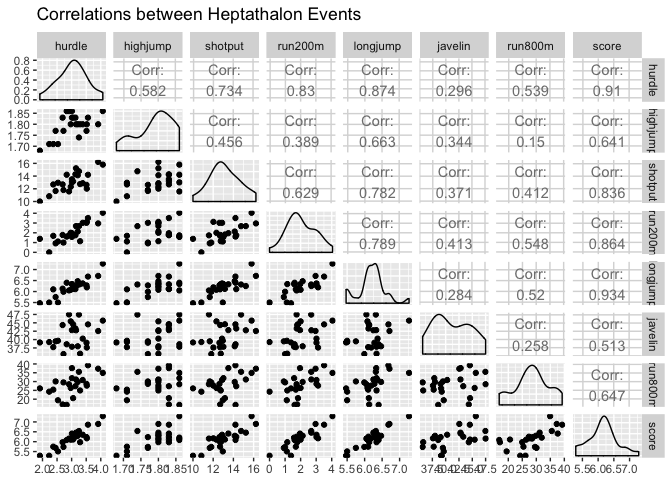
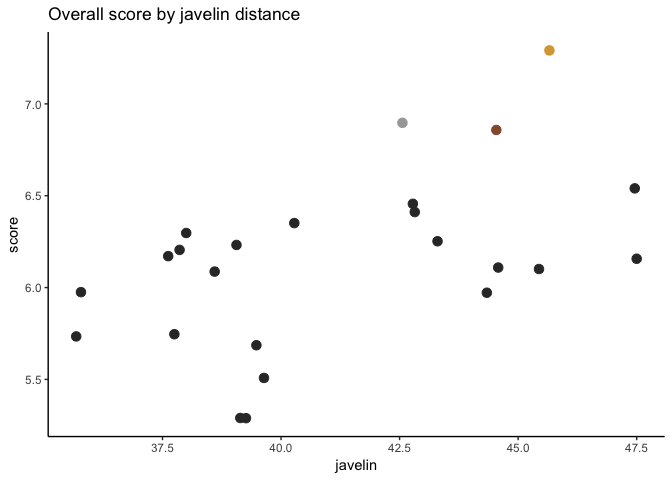
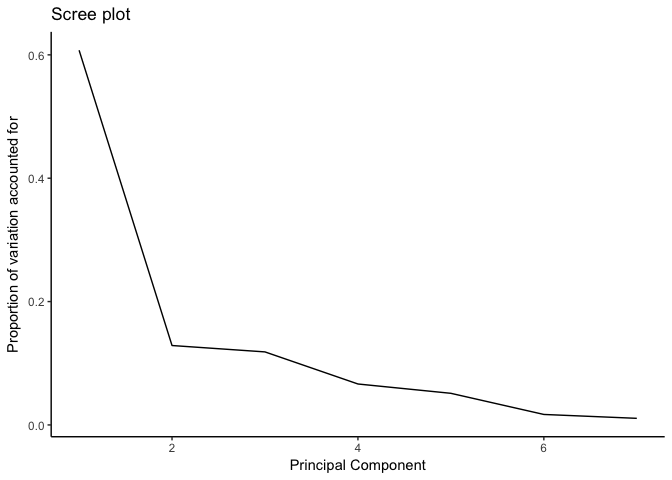
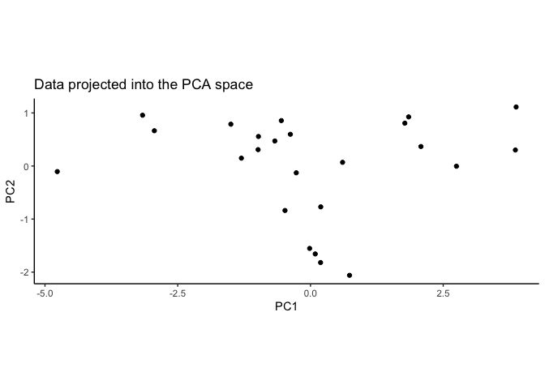
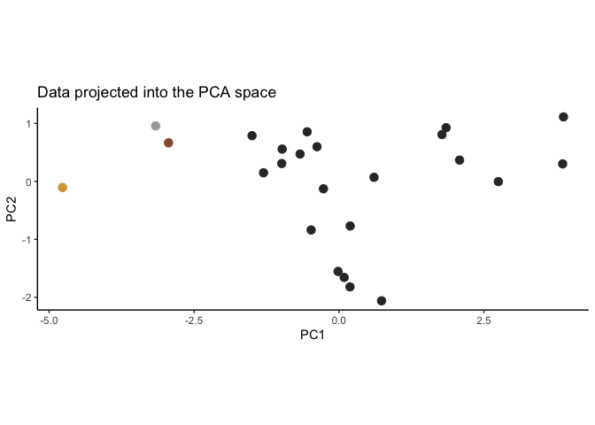
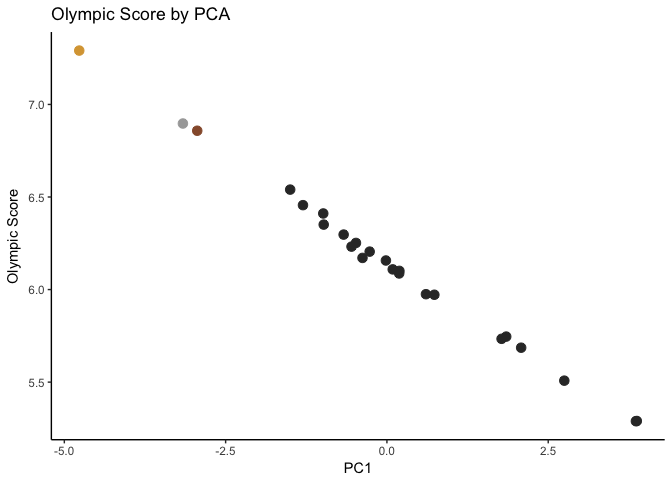

STAT 407 - Principal Component Analysis Example
================

Women's Heptathalon Data - 1988 Olympics
========================================

Example from Chapter 3, Section 10 of textbook

    ## # A tibble: 6 x 11
    ##                 Athlete           Team hurdle highjump shotput run200m
    ##                   <chr>          <chr>  <dbl>    <dbl>   <dbl>   <dbl>
    ## 1         Jane Flemming      Australia   3.38     1.80   12.88    3.02
    ## 2 Jacqueline Hautenauve        Belgium   2.72     1.77   11.81    1.00
    ## 3    Conceição Geremias         Brazil   2.53     1.71   12.95    1.11
    ## 4      Svetla Dimitrova       Bulgaria   3.52     1.80   12.02    3.12
    ## 5           Dong Yuping          China   2.83     1.86   14.21    1.61
    ## 6         Hsu Huei-Ying Chinese Taipei   1.91     1.68   10.00    1.38
    ## # ... with 5 more variables: longjump <dbl>, javelin <dbl>, run800m <dbl>,
    ## #   score <dbl>, Medal <chr>

Scores or PCAs?
---------------

There are 7 events, and each competitor is assigned points for their performance in each event to get an overall score to win the medals.

We want to perform PCA to see how closely the scores assigned match the results from the points.

Plotting the Data
-----------------





Performing PCA
--------------

``` r
heptath_pca <- prcomp(heptath[,3:9], scale = TRUE) 
print(heptath_pca)
```

    ## Standard deviations (1, .., p=7):
    ## [1] 2.0620757 0.9494185 0.9104122 0.6817527 0.5991095 0.3449102 0.2737078
    ## 
    ## Rotation (n x k) = (7 x 7):
    ##                 PC1          PC2         PC3          PC4         PC5
    ## hurdle   -0.4498467  0.083888781 -0.19761604  0.047216188 -0.22937280
    ## highjump -0.3194019 -0.622856979 -0.27144698 -0.558421856  0.06239568
    ## shotput  -0.4028474 -0.028950765 -0.07471933  0.563900216  0.64538683
    ## run200m  -0.4223948  0.193404638  0.08263836  0.213988483 -0.65410844
    ## longjump -0.4545098 -0.002524255 -0.26083718 -0.003000999  0.01695081
    ## javelin  -0.2379204 -0.413130316  0.85127176  0.051030071 -0.01375579
    ## run800m  -0.3028724  0.629353101  0.28662296 -0.565285825  0.31406422
    ##                   PC6        PC7
    ## hurdle   -0.807181049  0.2125230
    ## highjump  0.038453301 -0.3451685
    ## shotput   0.007495525 -0.3110130
    ## run200m   0.314518662 -0.4525232
    ## longjump  0.494435025  0.6932648
    ## javelin  -0.057963341  0.2046963
    ## run800m   0.013273376 -0.1080263

Percent of variation in data explained by the PCs

``` r
perc_var <- heptath_pca$sdev^2 / sum(heptath_pca$sdev^2)
round(perc_var * 100 , 2)
```

    ## [1] 60.75 12.88 11.84  6.64  5.13  1.70  1.07

PCA Plots
---------

``` r
perc_var <- heptath_pca$sdev^2 / sum(heptath_pca$sdev^2)
qplot(x = 1:7, y = perc_var, geom = 'line') + theme_classic() + 
  labs(x = "Principal Component", y = "Proportion of variation accounted for", title = "Scree plot")
```



Where are the medal winners?
----------------------------





How do PCs compare to Score?
----------------------------

``` r
cor(heptath$score, heptath$PC1)
```

    ## [1] -0.9982914


